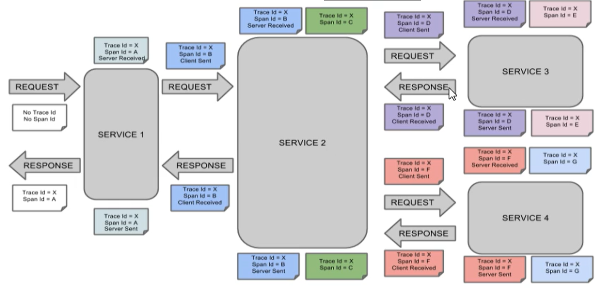
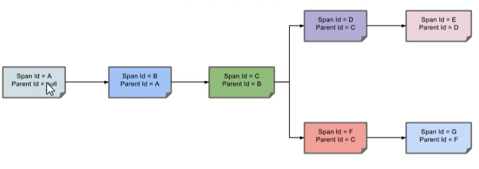

# Sleuth 分布式请求链路跟踪

## 一、概述

在微服务框架中，一个由客户端发起的请求在后端系统中会经过多个不同的服务节点调用来协同产生最后的请求结果，每一个前端请求都会形成一条复杂的分布式服务调用链路，链路中的任何一环出现高延迟或者错误都会引起整个请求最后的失败。

### 官网
https://spring.io/projects/spring-cloud-sleuth
### 监控链路调用
这包括将跟踪数据（跨度）报告到的位置，要保留（跟踪）多少个跟踪，是否发送了远程字段（行李）以及要跟踪哪些库。微服务中节点过多，使用它能更好的做监控。
### 安装Zipkin

Spring Cloud 从 F 版本开始已经不需要自己构建 Zipkin Server 端了，只需要调用 jar 包即可。

1. Sleuth 负责链路监控，Zipkin负责展现

    1. https://dl.bintray.com/openzipkin/maven/io/zipkin/java/zipkin-server/

3. 下载 exec.jar

4. 使用
命令行打开到jar包所在目录
java -jar zipkin-server-2.12.9-exec.jar
成功后访问http://localhost:9411/
### Zipkin 链路监控原理

每一条请求链路都是通过 Trace ID  来唯一标识， Span 标识发起的请求信息，各个 Span 通过 parent ID 进行相关联。



简化之后为：



# 使用

### 改变最原始的模块80与8001

cloud-provider-payment8001

cloud-consumer-order80

- 在80 和 8001 添加依赖

```xml
<!-- 包含了sleuth zipkin 数据链路追踪-->
<dependency>
    <groupId>org.springframework.cloud</groupId>
    <artifactId>spring-cloud-starter-zipkin</artifactId>
</dependency>
```
2. 80 和8001 的 yml 增加如下配置
```yml
# 服务名称
spring:
  application:
    name: cloud-payment-service
  zipkin:
    # 放到 zipkin 上，监控的数据放入 9411
    base-url: http://localhost:9411
  sleuth:
    sampler:
      # 采样率介于 0-1 之间，1 表示全部采集
      probability: 1
```
3. controller 80
```java
   /**
     * 测试调用链路追踪
     * @return
     */
    @GetMapping("/consumer/payment/zipkin")
    public String paymentZipkin(){
        String result = restTemplate.getForObject("http://localhost:8001"+"/payment/zipkin",
                String.class);
        return result;
    }
```
4. controller 8001
```java
    @GetMapping("/payment/zipkin")
    public String paymentZipkin(){
        return "我是 zipkin";
    }
```
5. 测试
  依次打开7001,8001,80

  首先通过：`http://eureka7001.com:7001/` 查看服务是否已经注入

  通过：`http://localhost:8001/payment/zipkin`进行自测

  通过：`http://localhost/consumer/payment/zipkin` 从 80 端访问测试。

  最后访问http://localhost:9411/可以查看到访问的链路
