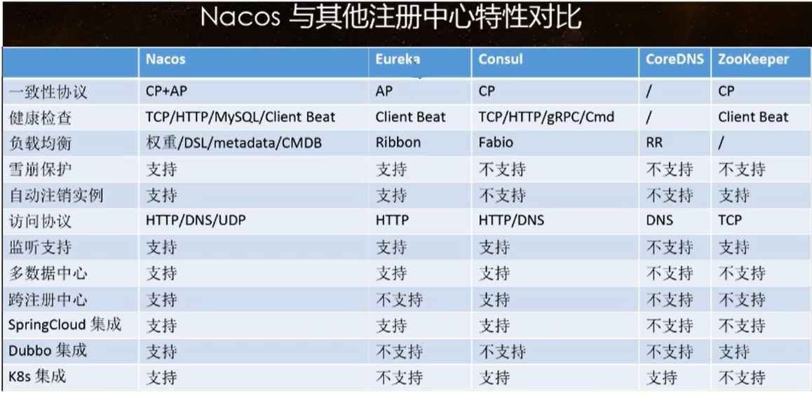
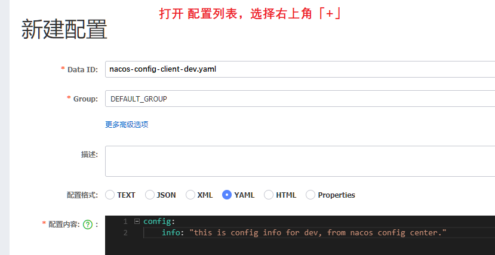
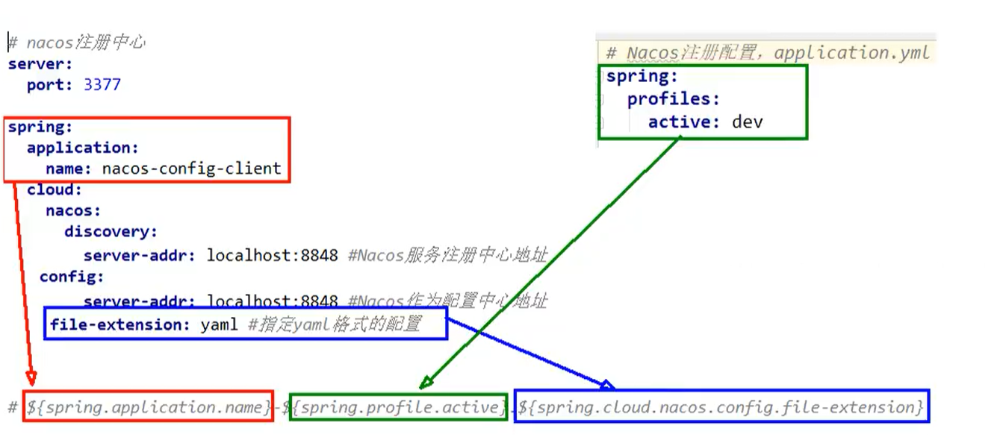
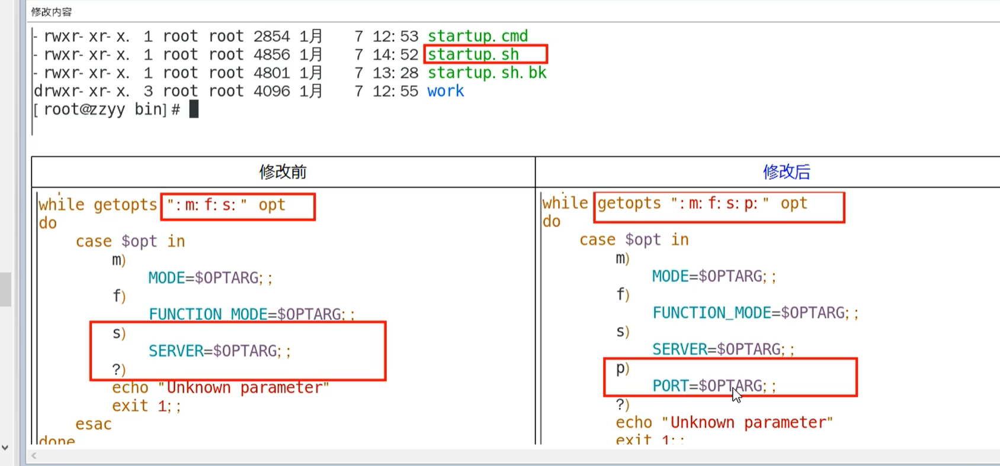
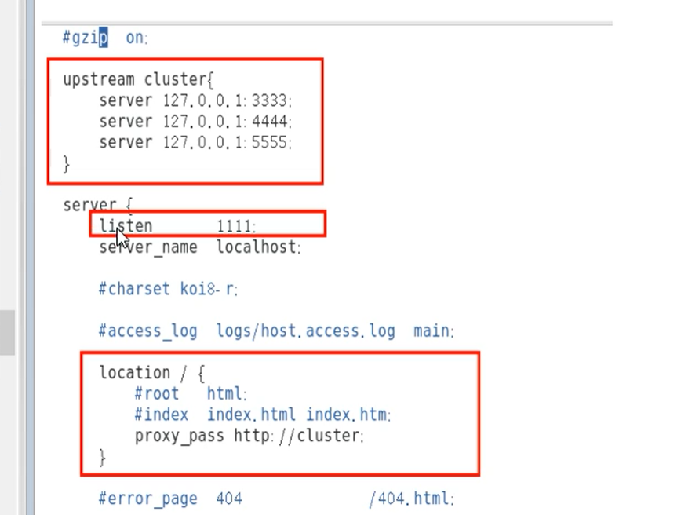
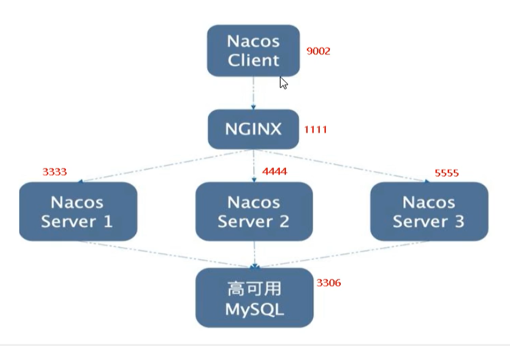

# Nacos 服务注册和配置中心

[TOC]


## 一、概述

### （一）概念
Dynamic Naming and Configuration Service：动态命名和配置服务
Nacos = Eureka+Config+Bus 注册中心与配置中心的组合

一个更易于构建云原生应用的动态服务发现、配置管理和服务管理平台。

==Nacos 自带 Ribbon 实现负载均衡，Nacos 支持 AP 与 CP 的切换==

主要作用：

- 替代 Eureka 做注册中心

- 替代 Config 做配置中心

[GitHub 开源网址](https://github.com/alibaba/nacos)、[官网](https://nacos.io)

| 服务注册与发现框架 | CAP 模型 | 控制台管理 | 社区活跃度 |
| ------------------ | -------- | ---------- | ---------- |
| Eureka             | AP       | 支持       | 低         |
| Zookeeper          | CP       | 不支持     | 中         |
| Consul             | CP       | 支持       | 高         |
| Nacos              | AP       | 支持       | 高         |

### （二）基本安装
[下载链接](https://github.com/alibaba/nacos/releases/tag/1.1.4)

- 步骤一：解压 cmd 进入 bin目录下然后执行 `startup.cmd` 启动程序。

- 步骤二：进入 http://localhost:8848/nacos，默认账号密码都是 nacos 验证是否启动成功。


## 二、作为服务注册中心

### 服务提供者模块：cloud-alibaba-provider-payment9001
- 步骤一：首先在 父 pom 即 SpringCloud2020 的 pom.xml 中引入下列依赖

    ```xml
    <dependencyManagement>
        <dependencies>
              <!--spring cloud 阿里巴巴-->
                <dependency>
                    <groupId>com.alibaba.cloud</groupId>
                    <artifactId>spring-cloud-alibaba-dependencies</artifactId>
                    <version>2.1.0.RELEASE</version>
                    <type>pom</type>
                    <scope>import</scope>
                </dependency>
        </dependencies>
    </dependencyManagement>
    ```

- 步骤二：子 pom 中要引入 Nacos 依赖

    ```xml
    <dependency>
        <groupId>com.alibaba.cloud</groupId>
        <artifactId>spring-cloud-starter-alibaba-nacos-discovery</artifactId>
    </dependency>
    ```

- 步骤三：配置 yaml 文件

    ```yaml
    server:
      port: 9001
    
    spring:
      application:
        name: nacos-payment-provider
      cloud:
        nacos:
          discovery:
            server-addr: localhost:8848 #配置Nacos地址
    
    # 暴露端口，用于监控
    management:
      endpoints:
        web:
          exposure:
            include: '*'
    ```

- 步骤四：主启动类

    ```java
    @SpringBootApplication
    @EnableDiscoveryClient
    ```

- 步骤五：业务类：Controller

    ```java
    package com.gjxaiou.springcloud.controller;
    
    @RestController
    public class PaymentController {
    
        @Value("${server.port}")
        private String serverPort;
    
        @GetMapping(value = "/payment/nacos/{id}")
        public String getPayment(@PathVariable("id") Integer id) {
            return "nacos registry, serverPort: " + serverPort + " id: " + id;
        }
    }
    ```

- 测试

    启动 Nacos 和 9001，然后 测试 http://localhost:9001/payment/nacos/1
    进入nocas 控制面板=》「服务管理」=》「服务列表」查看 9001 服务是否注入成功。

参照 9001 新建 9002 用于测试


### 消费者模块：cloud-alibaba-consumer-nacos-order83

- 步骤一：pom 依赖同 9001

- 步骤二：yaml 文件配置如下：

```yml
server:
  port: 83


spring:
  application:
    name: nacos-order-consumer
  cloud:
    nacos:
      discovery:
        server-addr: localhost:8848


# 消费者要去访问的微服务名称
service-url:
  nacos-user-service: http://nacos-payment-provider
```
4. 主启动类
同 9001 一样
5. config类
```java
@Configuration
public class ApplicationContextConfig {
    @Bean
    @LoadBalanced
    public RestTemplate getRestTemplate(){
        return new RestTemplate();
    }
}
```
6. controller
```java
@RestController
@Slf4j
public class OrderNacosController {
    @Resource
    private RestTemplate restTemplate;

    @Value(("${service-url.nacos-user-service}"))
    private String serverURL;

    @GetMapping(value = "/consumer/payment/nacos/{id}")
    public String paymentInfo(@PathVariable("id") Long id){
        return restTemplate.getForObject(serverURL+"/payment/nacos/"+id,String.class);
    }
}
```
7. 启动 Nacos、80、9001/9002测试
http://localhost:83/consumer/payment/nacos/1  默认进行了轮询。因为内部整合了 Ribbon
8. 


**配置中心比较**



Nacos支持AP和CP模式的切换

C是所有节点在同一时间看到的数据是一致的;而A的定义是所有的请求都会收到晌应。

何时选择使用何种模式一般来说,如果不需要存储服务级别的信息且服务实例是通过naos-client注册,并能够保持心跳上报,那么就可以选择AP模式。当前主流的服务如 Spring cloud和 Dubbo服务,都适用于AP模式,AP模式为了服务的可能性而减弱了一致性,因此AP模式下只支持注册临时实例。

如果需要在服务级别编辑或者存储配置信息,那么CP是必须,K8S服务和DNS服务则适用于CP模式。CP模式下则攴持注册持久化实例,此时则是以Raft协议为集群运行模式,该模式下注册实例之前必须先注册服务,如果服务不存在,则会返回错误。

切换命令：`curl -X PUT'$NACOS_SERVER:8848/nacos/v1/ns/operator/switches?entry=serverMode&value=CP`

# 作为配置中心

### 配置
1. 建模块cloud-ali-config-nacos-client3377
2. pom
```xml
<dependency>
    <groupId>com.alibaba.cloud</groupId>
    <artifactId>spring-cloud-starter-alibaba-nacos-discovery</artifactId>
</dependency>
<dependency>
    <groupId>com.alibaba.cloud</groupId>
    <artifactId>spring-cloud-starter-alibaba-nacos-config</artifactId>
</dependency>
```
3. yml：有application与bootstrap
application
```yml
spring:
  profiles:
    active: dev # 表示开发环境
```
bootstrap
```yml
server:
  port: 3377

spring:
  application:
    name: nacos-config-client
  cloud:
    nacos:
      discovery:
        server-addr: localhost:8848 # 服务注册中心
      config:
        server-addr: localhost:8848 # 服务注册中心
        file-extension: yaml # 指定yaml格式的配置
```
4. 主启动
```java
@SpringBootApplication
@EnableDiscoveryClient
```
5. controller
```java
@RestController
@RefreshScope // 动态刷新
public class ConfigClientController {
    @Value("/config.info")
    private String configInfo;

    @GetMapping("/config/info")
    public String getConfigInfo(){
        return configInfo;
    }
}
```
6. 配置 dataid
   
    配置规则见：[官方文档](https://nacos.io/zh-cn/docs/quick-start-spring-cloud.html)
    
    `${prefix}-${spring.profile.active}.${file-extension}`
    
    * prefix 默认为 spring.application.name 的值，也可以通过配置项 spring.cloud.nacos.config.prefix 来配置。
    
    * spring.profile.active 即为当前环境对应的 profile，详情可以参考 Spring Boot文档。 注意：当 spring.profile.active 为空时，对应的连接符 - 也将不存在，dataId 的拼接格式变成 `${prefix}.${file-extension}`
    
    * file-exetension 为配置内容的数据格式，可以通过配置项 spring.cloud.nacos.config.file-extension 来配置。目前只支持 properties 和 yaml 类型。
    
    * 得到 data id为
        ```yaml
            ${prefix}-${spring.profile.active}.${file-extension}
            ${spring-application-name}-${spring.profiles.active}.${spring.cloud.nacos.config.file-extension}
            # 依据上述规则，这里配置的 data id 为
            nacos-config-client-dev.yaml
        ```
        
    * 配置 yaml 文件
     
     
    
     
    
    * 启动 3377 测试访问http://localhost:3377/config/info看是否得到配置信息
    
    * 更改nacos中内容查看3377中是否变化


### 分组

namespace 可以用于区分部署环境、 Group 和 DataID 逻辑上区分两个目标对象。


1. Nacos默认的命名空间是 public ，Namespace主要实现隔离。
比如说现在有三个环境：开发，测试，生产环境，就可以创建三个Namespace，不同的Namespace之间是隔离的。

2. Group默认是 DEFAULT_GROUP，Group 可以把不同的微服务划分到一个组里去。
3. service就是微服务，一个微服务可以包含多个 Cluster （集群）
4. Instance就是微服务的实例
### 三种方案加载配置
###### DataID 方案
指定 spring.profile.active 与配置文件的DataID来使不同环境下读取不同的配置
即可以使用 `默认空间+默认分组+新建dev和test两个DataID`

1. Nacos配置中心新建nacos-config-client-test.yaml
2. 将spring中的配置spring.profile.active改成test，就会加载Nacos中新建的yaml

然后 3377 的 application.yml 中通过 `active` 指定环境来选取配置中心配置的值。项目重启之后访问：http://localhost:3377/config/info 获取的就是测试环境的配置值。

```yaml
spring:
	profiles:
		active: test
		#active: dev
```


###### Group 方案
1. Nacos中新建配置 nacos-config-client-info.yaml ,分组为 DEV_GROUP
2. Nacos中新建配置 nacos-config-client-info.yaml ,分组为 TEST_GROUP
3. 将 spring.profile.active 改成 info（因为现在所有文件名都都一样，后面都是 info） 
4. 增加配置 spring.cloud.nacos.config.group 指定组名，选择调用哪个组的文件
5. 测试：http://localhost:3377/config/info
###### Namespace
1. 找到左侧命名空间，新建test与dev命名空间
2. dev 命名空间新建 nacos-config-client-dev.yaml 分组为 DEV_GROUP
3. yml文件
```yml
spring:
  application:
    name: nacos-config-client
  cloud:
    nacos:
      config:
      # 这个为命名空间的流水号
        namespace: 625e1f16-7820-412f-84d0-890d0092577a
        group: DEV_GROUP
```
4. 测试：http://localhost:3377/config/info
###### 总结
如同包一样 Namespace>Group>DataID

# Nacos 集群与持久化配置（重要）

默认 Nacos 使用嵌入式数据库 derby 实现数据的存储，所以如果启动多个默认配置下的 Nacos 节点，数据存储是存在一致性问题的（每个节点都有自身的数据存储）。

**解决方案**：Nacos 采用集中式存储的方式来支持集群化部署，目前只支持 MySQL 存储。

### 解决问题
1. 如果Nacos挂掉怎么办
2. Nacos停机了，但是有些数据仍需要保留
### 持久化配置
###### Nacos支持三种部署模式
1. 单机模式
2. 集群模式-用于生产环境
3. 多集群模式-用于多数据中心场景
默认Nacos使用嵌入式数据库derby来实现数据的存储。但是如果启动多个默认配置下的Nacos节点，数据存储是存在一致性问题的。为了解决这个问题，Nacos采用集中式存储的方式来支持集群化部署，目前只支持MySQL的存储。
###### 环境准备
1. 64 bit OS Linux/Unix/Mac，推荐使用Linux系统。
2. 64 bit JDK 1.8+；下载.配置。
3. Maven 3.2.x+；下载.配置。
4. 3个或3个以上Nacos节点才能构成集群。

###### 切换数据库
1. 安装数据库，版本要求：5.6.5+
2. 初始化mysql数据库，数据库初始化文件：nacos\conf\nacos-mysql.sql
3. 修改nacos\conf\application.properties文件，增加支持mysql数据源配置（目前只支持mysql），添加mysql数据源的url、用户名和密码。
    ```properties
    pring.datasource.platform=mysql

    db.num=1
    db.url.0=jdbc:mysql://11.162.196.16:3306/nacos_config?characterEncoding=utf8&connectTimeout=1000&socketTimeout=3000&autoReconnect=true # 更改数据库名,更改127.0.0.1
    db.user=root  #更改用户名
    db.password=GJXAIOU #更改密码
    ```
4. 重启Nacos
5. 观察到之前写过的配置全部消失，因为切换了数据库
### 集群
 

###### 前提配置
1个Nginx+3个nacos注册中心+1个mysql

###### 下载linux版
1. 下载：https://github.com/alibaba/nacos/releases
2. 解压
3. 同windows一样，需要在linux下设置mysql为nacos持久化存储
###### linux安装mysql
1. 下载：``wget https://dev.mysql.com/get/Downloads/MySQL-5.7/mysql-5.7.24-linux-glibc2.12-x86_64.tar.gz``
2. 将安装包放到指定目录下，解压tar xzvf mysql-5.7.24-linux-glibc2.12-x86_64.tar.gz
3. 移动到 /usr/local目录下
https://blog.csdn.net/dc282614966/article/details/81098074

###### 步骤一：创建 nacos 数据库
1. source /usr/local/nacos/conf/nacos-mysql.sql
2. 修改nacos\conf\application.properties文件，增加支持mysql数据源配置（目前只支持mysql），添加mysql数据源的url、用户名和密码。
    ```properties
    spring.datasource.platform=mysql

    db.num=1
    db.url.0=jdbc:mysql://11.162.196.16:3306/nacos_devtest?characterEncoding=utf8&connectTimeout=1000&socketTimeout=3000&autoReconnect=true # 更改数据库名,更改127.0.0.1
    db.user=nacos_devtest   #更改用户名
    db.password=youdontknow #更改密码
    ```
###### 集群配置
1. 复制nacos/config下的 cluster.config.example 重命名为 cluster.config
2. 修改文件内容,ip地址查看 id addr  （这里 ip 不能写 127.0.0.1，必须是  hostname -i 能够识别的ip）
```
192.168.150.66:3333
192.168.150.66:4444
192.168.150.66:5555
```
3. 修改配置 bin 下的 startup.sh,使其通过传递不同的端口号启动不同的实例。即可以通过 `./startup.sh -p 3333` 表示启动端口号为 3333 的 Nacos 服务器实例。（使用一台主机模拟出多台 Nacos）

    

    


3. 安装Nginx
    https://blog.csdn.net/t8116189520/article/details/81909574
    命令： cd /usr/local/nginx/sbin

启动，关闭，重启，命令：

./nginx 启动

./nginx -s stop 关闭

./nginx -s reload 重启
5. 配置nginx
    https://www.cnblogs.com/linchenguang/p/12827582.html

  直接修改 ngix.conf



启动：./nginx -c /usr/local/nginx/conf/nginx.conf

测试：

- 分别启动 Nacos：`./startup.sh -p 3333`  和  `./startup.sh -p 4444`  和 `./startup.sh -p 5555`
- 启动 Nginx：见上

`http://192.168.111.144:1111/nacos/#/login`


5. 注意
  6. 关闭防火墙
  7. 打开mysql服务
  8. 有错误要去nacos的log文件夹内查询
  9. 不要将安装包在windows下载后直接拖到linux
10. 测试
    将 9002 中的 server-addr ：idea对应端口换成 nginx 地址即可：192.168.150.66:1111



本质上 Nginx 和 MySQL 也应该集群化。


### Docker 配置过程

#### 配置 Nacos

- 拉取镜像：`docker pull nacos/nacos-server`
- 修改配置：`docker exec -it 容器id /bin/bash`  进入容器之后然后修改。