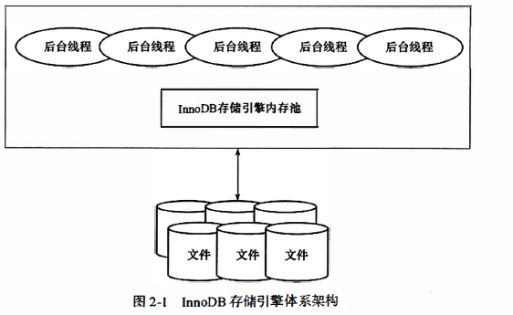
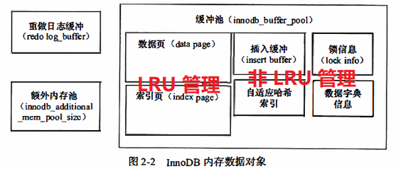

# 第二章：InnoDB 存储引擎

## 一、InnoDB 体系架构

InnoDB 的存储引擎的体系架构如图，lnnoDB 存储引擎由多个内存块共同组成一个大的内存池，作用如下：

- 维护所有进程／线程需要访问的多个内部数据结构．
- 缓存磁盘上的数据， 方便快速地读取， 同时在对磁盘文件的数据修改之前在这里缓存。
- 重做日志(redo log)缓冲。

### （一）后台线程

**InnoDB 存储引擎是多线程的模型**， 因此其后台有多个不同的后台线程，**后台线程的主要作用是负责刷新内存池中的数据， 保证缓冲池中的内存缓存的是最近的数据。 此外将已修改的数据文件刷新到磁盘文件， 同时保证在数据库发生异常的情况下InnoDB能恢复到正常运行状态。**

- **Master Thread**（核心的线程）： **主要负责将缓冲池中的数据异步刷新到磁盘， 保证数据的一致性**， 包括~~脏页的刷新~~、合并插入缓冲(INSERT BUFFER)、undo 页的回收等。
- **IO Thread**：在 InnoDB 存储引擎中大量使用了 AIO (Async IO)来处理写 IO 请求， 这样可以极大提高数据库的性能。而 IO Thread 的工作主要是负责这些 IO 请求的回调(call back)处理。
- Purge Thread ：事务被提交后， 其所使用的 undolog 可能不再需要， 因此需要 PurgeThread（可以有多个该线程来加快回收）来**回收已经使用并分配的 undo 页**。
- Page Cleaner Thread：将之前版本中**脏页的刷新操作**都放入到单独的线程中来完成。减轻原 Master Thread 的工作及对于用户查询线程的阻塞，提高 InnoDB 存储引擎的性能。

### （二）内存

#### 缓冲池

lnnoDB 存储引擎是基于磁盘存储的， 并将**其中的记录按照页的方式进行管理**。因此使用缓冲池（就是一块内存区域）技术来提高数据库的整体性能（平衡 CPU 和磁盘速度差）。

- 在数据库中进行读取页的操作， 首先将从磁盘读到的页存放在缓冲池中，这个过程称为将页"FIX"在缓冲池中。下一次再读相同的页时， 首先判断该页是否在缓冲池中。若在缓冲池中， 称该页在缓冲池中被命中， 直接读取该页。否则， 读取磁盘上的页。

- 对于数据库中页的修改操作， 则首先修改在缓冲池中的页， 然后再以一定的频率刷新到磁盘上。 页从缓冲池刷新回磁盘的操作并不是在每次页发生更新时触发，而是通过一种称为**Checkpoint 的机制刷新回磁盘。**

**缓冲池中缓存的数据页类型有：数据页、索引页、undo 页、插入缓冲(insert buffer)、自适应哈希索引(adaptive hash index)、InnoDB存储的锁信息(lock info)、数据字典信息(data dictionary)等**。

​	

InnoDB 允许有多个缓冲池实例。每个页根据哈希值平均分配到不同缓冲池实例中 。这样做的好处是减少数据库内部的资源竞争，增加数据库的并发处理能力，默认为 1 个。

**LRU List、Free List 和 Flush List**

缓冲池是通过 LRU (Latest Recent Used, 最近最少使用）算法来进行管理的。 即最频繁使用的页在 LRU 列表的前端， 而最少使用的页在 LRU 列表的尾端。 **当缓冲池不能存放新读取到的页时， 将首先释放 LRU 列表中尾端的页。**

在 InnoDB 存储引擎中， 缓冲池中页的大小默认为 16 KB，同时对 LRU 算法进行了优化：

**LRU 列表中加入 midpoint 位置（默认在列表长度的 5/8 处，也可以自定义）**。新读取到的页，虽然是最新访问的页，但并不是直接放入到 LRU 列表的首部，而是放入到 LRU 列表的 midpoint 位置【midpoint insertion strategy 算法】。midpoint 之后的列表称为 old 列表， 之前列表为 new 列表（该列表中的页都是最为活跃的热点数据）。

**原因**：**因为若直接将读取到的页放入到 LRU 的首部， 那么某些 SQL 操作（如索引或数据的扫描操作）可能会使缓冲池中的页被刷新出，从而影响缓冲池的效率**。这类操作需要访问表中的许多页，甚至是全部的页，而这些页通常来说又仅在这次查询操作中需要，并不是活跃的热点数据。 如果页被放入LRU 列表的首部，那么非常可能将需要的热点数据页从 LRU 列表中移除，而在下 次需要读取该页时，InnoDB存储擎需要再次访问磁盘。

**解决方式**：通过参数 `innodb_old_blocks_time = ` 来进一步管理 LRU 列表，该参数表示页读取到 mid 位置后需要等待多久才会被加入到 LRU 列表的热端。因此当需要执行上述所说的 SQL 操作之前， 可以通过下面的方法尽可能使 LRU 列表中热点数据不被刷 出。`SET GLOBAL innodb_old_blocks_time=lOOO;` 相当于阻塞一段时间，执行完成之后再执行一遍该语句，将值换成 0 即可。

 **LRU 列表用来管理已经读取的页**，但当数据库刚启动时，LRU 列表是空的，即没有任何的页。 这时页都存放在 Free 列表中。 当需要从缓冲池中分页时， 首先从 Free 列表中查找是否有可用的空闲页， 若有则将该页从 Free 列表中删除， 放入到 LRU 列表中。否则根据 LRU 算法， 淘汰 LRU 列表末尾的页，将该内存空间分配给新的页。

当页从 LRU 列表的 old 部分加人到 new 部分时，称此时发生的操作为 page made young, 而因为 `innodb_old_ blocks_time` 的设置而导致页没有从 old 部分移动到 new 部分的操作称为 page not made young。 可以通过命令 `SHOW ENGINE INNODB STATUS` 来观察 LRU 列表及 Free 列表的使用情况和运行状态。

但是可能 `Free buffers` 与 `Database pages` 的数量之和不等于 `Buffer pool size`。  因为缓冲池中的页还可能会被分配给自适应哈希索引、Lock 信息、Insert Buffer 等页， 而这部分页不需要  LRU 算法进行维护， 因此不存在于 LRU 列表中。

**针对每个 页**

通过 `INNODB_BUFFER_PAGE_LRU`表可以看到缓冲池 LRU 列表中指定 SPACE 的表的页类型。同时 Innodb 支持压缩页，即将原本16KB的页压缩为IKB、2KB、4KB和8KB。对于非16KB的页，是通过unzip_LRU列表进行管理的。（LRU中的页包含了unzip_LRU列表中的页）。`SHOW ENGINE INNODB STATUS\G;`可查看两者数量。
    
unzip_LRU列表中对不同压缩页大小的页进行分别管理并在缓存池中分配内存。其次，通过伙伴
    算法进行内存的分配。例如对需要从缓冲池中申请页为4KB的大小，其过程如下：

- 检查 4KB 的 unzip_LRU 列表， 检查是否有可用的空闲页：

- 若有，则直接使用；
- 否则， 检查 8KB 的 unzip_LRU 列表；
- 若能够得到空闲页， 将页分成 2 个 4KB 页， 存放到 4KB 的 unzip_LRU 列表；
- 若不能得到空闲页， 从 LRU 列表中申请一个 16KB 的页，将页分为 1 个 8KB 的页、2 个 4KB 的页， 分别存放到对应的 unzip_LRU 列表中。

在 LRU 列表中的页被修改后变为**脏页**, 即缓冲池中的页和磁盘上的页的数据产生了不一致。 这时数据库会**通过CHECKPOINT 机制将脏页刷新回磁盘，**而 Flush 列表中的页即为脏页列表。**脏页既存在于 LRU 列表中， 也存在于 Flush 列表中**。**LRU 列表用来管理缓冲池中页的可用性，Flush列表用来管理将页刷新回磁盘，二者互不影响。**

- 重做日志缓冲

    InnoDB 存储引擎首先将重做日志信息先放入到**重做日志缓冲区**， 然后按一定频率将其刷新到重做日志文件。因为一般每秒会将重做日志缓冲刷新到日志文件，一般缓冲区默认 8 MB。

    **重做日志在下列三种情况下会将重做日志缓冲中的内容刷新到外部磁盘的重做日志文件中。**

    - Master Thread 每一秒将重做日志缓冲刷新到重做日志文件；

- 每个事务提交时会将重做日志缓冲刷新到重做日志文件；

    - 当重做日志缓冲池剩余空间小于1/2 时， 重做日志缓冲刷新到重做日志文件。

- 额外的内存池

    在 InnoDB 存储引擎中， 对内存的管理是通过一种称为内存堆 Cheap)的方式进行的。 在对一些数据结构本身的内存进行分配时， 需要从额外的内存池中进行申请， 当该区域的内存不够时， 会从缓冲池中进行申请。 

### 2.4 Checkpoint 技术

因为**对页的操作是在缓冲池中完成**，但是如果语句修改了页中记录，则该页为脏页。 数据库需要将新版本的页从缓冲池刷新到磁盘。如果每次修改都刷新会磁盘性能开销较大，同时如果刷新到磁盘过程中发生宕机则数据不可恢复。【因为缓冲池和重做日志都不可能无限大，所以得刷新会磁盘】

**为了避免发生数据丢失的问题， 当前事务数据库系统普遍都采用了 Write Ahead Log 策略， 即当事务提交时， 先写重做日志， 再修改页。 当由于发生者机而导致数据丢失时， 通过重做日志来完成数据的恢复。 这也是事务 ACID中D (Durability持久性）的要求。**

因此Checkpoint(检查点）技术的目的是解决以下几个问题：

- 缩短数据库的恢复时间；

    当数据库发生宕机时，数据库不需要重做所有的日志，因为Checkpoint之前的页都已经刷新回磁盘。故**数据库只需对Checkpoint后的重做日志进行恢复。这样就大大缩短了恢复的时间。**

- 缓冲池不够用时，将脏页刷新到磁盘；

    当缓冲池不够用时，根据LRU算法会溢出最近最少使用的页，若此页为脏页，那么需要强制执行Checkpoint,将脏页也就是页的新版本刷回磁盘。

- 重做日志不可用时，刷新脏页。

    重做日志出现不可用的情况是因为当前事务数据库系统对重做日志的设计都是循环使用的，并不是让其无限增大的，这从成本及管理上都是比较困难的。重做日志可以被重用的部分是指这些重做日志已经不再需要，即当数据库发生右机时，数据库恢复操不需要这部分的重做日志，因此这部分就可以被覆盖重用。若此时重做日志还需要使用，那么必须强制产生Checkpoint,将缓冲池中的页至少刷新到当前重做日志的位置。

对于 lnnoDB 通过LSN(Log Sequence Number)来标记版本的。而LSN是8字节的数字，其单位是字节。每个页、重做日志、Checkpoint 中都有LSN。

InnoDB 中有两种 Checkpoint：区别在于：每次刷新多少页，每次从哪里取页，什么时候触发 cp。

- Sharp Checkpoint（默认）：**发生在数据库关闭时将所有的脏页都刷新回磁盘**，即参数innodb_fast_ shutdown= 1。但是运行时如果使用影响效率。
- FuzzyCheckpoint：即只刷新一部分脏页，而不是刷新所有的脏页回磁盘。